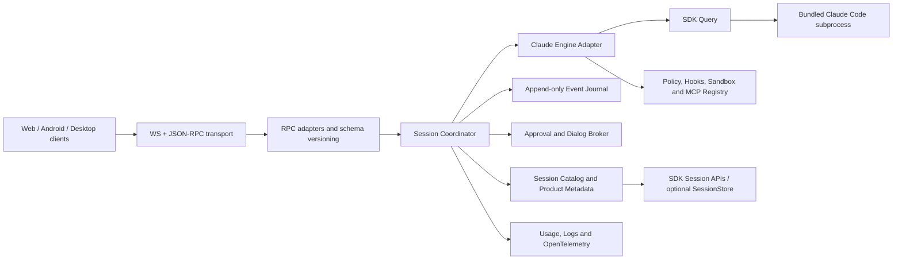

# cc-agent-daemon 接入 Claude Agent SDK：能力全景与实施指南

> 调研基线：2026-07-22  
> 目标工程：`repos/cc-agent-daemon`  
> 参考实现：`/Users/cddchen/Documents/pi`  
> 参考总结：`/Users/cddchen/Documents/dg-ai-notes/pi-agent/docs/typescript`  
> SDK 仓库：`/Users/cddchen/Documents/claude-agent-sdk-typescript`  
> 官方文档：[Agent SDK overview](https://code.claude.com/docs/en/agent-sdk/overview)

## 1. 结论先行

`cc-agent-daemon` 不应该重新实现 pi-agent 那样的 ReAct Agent Loop。Claude Agent SDK 已经内置了 Claude Code 的模型循环、工具执行、上下文压缩、会话恢复、权限系统、Hook、MCP 和 Subagent。daemon 的正确定位是：

1. 将 SDK `Query` 当作一个有状态、长生命周期、进程内的 Agent 引擎。
2. 在其上构建稳定的远程控制面：会话编排、轮次状态、事件协议、审批路由、断线恢复、安全隔离和可观测性。
3. 借鉴 pi-agent 的分层、消息和事件设计，但不要复制其 Loop、Tool Executor 和 Context Manager。
4. RPC 不直接等同于 SDK API，也不让 SDK 的易变消息结构成为 CCVibe 的唯一领域协议；应提供稳定的标准事件，同时保留原始 SDK 消息作为逃生舱。

当前 daemon 已经完成了最小可行链路：WebSocket + JSON-RPC、流式输入、SDK 事件转发、会话恢复/分叉、交互式权限和本地历史。但它仍是“SDK 直通原型”，距离可靠的多客户端 Agent daemon 还有三个 P0 问题：

- 把每一轮 `result` 错当成整个长连接 session 结束。
- 权限请求没有复用 SDK request ID、AbortSignal、建议项和 `reinitialize()`，断线期间可能永久挂起。
- 手写了缩水版 `Query` 接口且依赖使用 `^`，无法对 SDK 快速演进进行编译期和发布期治理。

## 2. 调研范围与源码边界

本次交叉核对了以下材料：

- pi-agent 三层包结构、Agent Loop、消息、工具、事件、上下文压缩和 session tree。
- `dg-ai-notes` TypeScript 总结的第 1～10 章及扩展系统设计。
- CCVibe Phase 1 设计和 `cc-agent-daemon` 的 engine、runner、registry、RPC、permission、history、store、security 实现及测试。
- Claude Agent SDK 官方文档全部主要能力页。
- `claude-agent-sdk-typescript` 仓库的 README、CHANGELOG、SessionStore 示例。
- daemon 当前安装包和最新 npm 包中的 `sdk.d.ts`、`sdk.mjs` 与 package metadata。

需要特别说明“源码调研”的边界：公开的 `anthropics/claude-agent-sdk-typescript` 仓库并不包含可逐模块阅读的未压缩 TypeScript SDK 源码。包的实际实现位于随 npm 发布的 bundled/minified `sdk.mjs`，公开类型契约在 `sdk.d.ts`，仓库主要提供 CHANGELOG、示例和 issue。因而：

- API 事实源：发布包的 `sdk.d.ts`。
- 行为事实源：官方文档、CHANGELOG、示例和打包后的 `sdk.mjs`。
- 不应把 minified 实现中的私有符号当作可依赖接口。

### 2.1 版本基线

| 项目 | 当前状态 | 风险 |
|---|---|---|
| `cc-agent-daemon/package.json` | `@anthropic-ai/claude-agent-sdk: ^0.3.178` | caret 会接收同一 minor 下大量行为变化 |
| 当前 lock/install | 0.3.179，Claude Code 2.1.179 | 已落后于调研时最新包 |
| 调研时最新 npm/CHANGELOG | 0.3.217，Claude Code 2.1.217 | 0.3.179→0.3.217 含多项 daemon 关键修复和新协议 |

建议使用精确版本，并通过 Renovate/Dependabot 或人工升级 PR 驱动：

```json
{
  "dependencies": {
    "@anthropic-ai/claude-agent-sdk": "0.3.217"
  }
}
```

每次升级至少运行：类型检查、协议快照、权限交互、断线重连、interrupt、resume/fork、MCP、subagent 和长会话内存测试。

## 3. 从 pi-agent 借什么，不借什么

### 3.1 借鉴的设计原则

| pi-agent 原则 | 对 daemon 的启示 |
|---|---|
| `pi-ai → pi-agent-core → pi-coding-agent` 依赖漏斗 | `transport/RPC → application/session coordinator → Claude SDK adapter` 单向依赖 |
| Trace 包含多个 Turn | 一个 SDK Query/Claude 子进程可承载多次用户输入；Session、Turn 必须分层建模 |
| 丰富内部消息，模型边界再翻译 | 保留完整 SDK message，另生成稳定的 CCVibe event；不要过早压成纯文本 |
| Agent/Turn/Message/Tool 明确事件嵌套 | daemon 发出显式生命周期事件，而不是让客户端猜测 raw message |
| Steering 和 Follow-up 语义分离 | `interrupt`、运行中排队输入、当前 turn 完成后的下一条输入应有不同状态/回执 |
| Tool pipeline 有 prepare/validate/before/execute/after | 使用 SDK permissions + hooks 形成安全和审计管线 |
| append-only session tree 支持恢复和分叉 | 事件 journal 使用追加写和 cursor；会话 transcript/分叉优先复用 SDK 官方能力 |
| Core event 与产品 event 分层 | SDK raw event 与 CCVibe domain event 分层，并进行协议版本化 |

### 3.2 不应复制的部分

pi-agent 是透明、可替换 provider 的 Agent 框架，它需要自己实现模型循环、tool executor、消息翻译、compaction 和 session tree。Claude Agent SDK 是 Claude Code Agent Harness 的程序化封装，这些能力已经在 SDK/Claude Code 子进程中实现。

因此 daemon 不应：

- 自己再次实现模型 → tool_use → tool_result → 模型的循环。
- 把 SDK tool use 截出来再自行执行内置 Read/Edit/Bash。
- 自己维护一份进入模型的压缩上下文。
- 解析私有 JSONL 来重建所有 Claude session 语义，除非作为兼容回退。
- 把 pi-agent 的 provider-neutral message 强行套在所有 SDK 细节上，导致 checkpoint、task、hook、MCP 等信息丢失。

## 4. Claude Agent SDK 的运行时本质

Agent SDK 不是对 Messages API 的薄封装。安装包自带对应平台的 Claude Code 原生可执行文件；`query()` 启动并监管 Claude Code 子进程，通过 stdin/stdout 的 stream-json 协议进行双向通信。

对 daemon 最重要的工程含义：

- 一个活跃 `Query` 对应一个本地长生命周期 Agent runtime/子进程。
- `system/init` 提供真正的 SDK session ID 和初始化能力信息。
- streaming input 模式可以在同一 `Query` 中发送多条消息、排队输入和 interrupt。
- 一条 `result` 表示一次 agent loop/用户 turn 的结果；在 streaming input 模式中不必意味着 Query 关闭。
- `close()`/AbortController 才是终止 runtime；`interrupt()` 主要中断当前执行。
- 需要双向控制时，权限、hooks、SDK MCP、elicitation、user dialog 都依赖 stdin 持续可用。
- SDK session 默认落在本机 Claude JSONL；session transcript 与工作区文件是两个不同的持久化域。

官方 loop 的抽象是：

```text
user input
  → model response
  → zero or more tool calls
  → SDK executes tools and returns tool results
  → repeat
  → final assistant message
  → result for this turn
```

## 5. 能力全景

### 5.1 输入模式

| 能力 | SDK 支持 | daemon 建议 |
|---|---|---|
| 单次字符串 prompt | 支持 | 只用于 batch/job 接口 |
| `AsyncIterable<SDKUserMessage>` | 支持 | 作为交互 session 主模式 |
| `Query.streamInput()` | 支持 | adapter 可统一封装，避免自建 queue 与 SDK 控制脱节 |
| 连续多轮输入 | 支持 | Session 内创建多个 Turn |
| 图片/多模态 content block | streaming input 支持 | `session.send` 参数升级为 content blocks，不只 string |
| 运行中排队输入 | 支持 | 返回 queued/accepted receipt，事件中标明何时消费 |
| interrupt | 支持 | 标记当前 Turn interrupted，不直接终结 Session |

daemon 是远程交互应用，应默认使用 streaming input。单条 string `query()` 更适合一次性任务，因为它不适合图片、实时中断、输入排队和自然多轮。

### 5.2 输出与流式消息

启用 `includePartialMessages` 后，主要会看到：

- `system/init`：session ID、工具、模型、权限模式、MCP、命令等初始化信息。
- `assistant`：每次模型响应的完整消息，包含 text/thinking/tool use。
- `user`：用户输入或工具结果回灌。
- `stream_event`：原始 API 增量事件，适合实时 UI。
- `result`：一次 loop/turn 结束，含成功/错误 subtype、usage、cost、turn 数和 session ID。
- 状态、compact boundary、rate limit、task、hook、prompt suggestion 等系统/可观测事件。

推荐协议原则：

1. 增量事件是 preview，完整 assistant/user/result 是 authoritative event。
2. 客户端用 message ID/content block index 合并 delta，不把 delta 写成最终历史。
3. `result` 后仍继续读取迭代器，SDK 可能有尾随系统事件。
4. raw event 必须带 `sdkVersion`，避免升级后无法解释历史。

### 5.3 Session 与历史

SDK 支持：

- 新 session、指定 `sessionId`。
- `resume`、`continue`、`resumeSessionAt`。
- `forkSession`，在旧上下文上创建新的 session ID。
- `persistSession: false` 的临时会话。
- `listSessions`、`getSessionInfo`、`getSessionMessages`。
- `renameSession`、`tagSession`、`deleteSession`、`forkSession`。
- `listSubagents`、`getSubagentMessages`。
- `SessionStore` 镜像到 S3/Redis/Postgres 等外部存储。

Session 保存的是 conversation/harness state，不是工作区快照。resume 后能记住对话和已读内容，但文件是否仍然一致取决于实际 filesystem。

daemon 的历史层应改为：

1. 以 SDK 官方 session API 为主要读写路径。
2. 本地 SQLite 只保存 CCVibe 产品元数据，如 pinned、archived、owner、tenant、workspace binding。
3. 私有 JSONL reader 作为旧版本/Claude Code 兼容回退，不作为唯一事实源。
4. SessionStore 用于跨机器 transcript 镜像，而非替代工作区持久卷。

SessionStore 是 local-first mirror：本地 transcript 写入仍是权威路径，镜像失败会产生 `mirror_error`。它不能与 `persistSession: false` 或 file checkpointing 组合使用。

### 5.4 Query 运行时控制面

当前版本的 `Query` 提供的主要控制方法包括：

- 生命周期：`interrupt()`、`close()`、`streamInput()`、`reinitialize()`。
- 行为：`setPermissionMode()`、`setMcpPermissionModeOverride()`、`setModel()`、`applyFlagSettings()`。
- 初始化/发现：`initializationResult()`、`supportedCommands()`、`supportedModels()`、`supportedAgents()`、`accountInfo()`。
- 上下文：`getContextUsage()`、`readFile()`、`seedReadState()`。
- 扩展：`mcpServerStatus()`、`setMcpServers()`、`reconnectMcpServer()`、`toggleMcpServer()`、`reloadPlugins()`、`reloadSkills()`。
- 文件回退：`rewindFiles()`。
- 后台任务：`backgroundTasks()` 将前台 Bash/subagent 任务转入后台，`stopTask()` 停止任务；实时任务集合从 task/background-task 事件维护。

这些方法应由 `ClaudeEngineAdapter` 以显式 capability 接口暴露，不要继续维护当前只含四个方法的手写 duck type。

### 5.5 Query Options 能力分类

| 类别 | 代表选项 | 接入建议 |
|---|---|---|
| 工作区 | `cwd`, `additionalDirectories` | 每 tenant/session 显式配置并校验 |
| 模型 | `model`, `fallbackModel`, `effort`, `thinking` | create 时设置，并支持运行时 setModel |
| 工具可见性 | `tools`, `toolAliases` | 与权限白名单分开建模 |
| 工具权限 | `allowedTools`, `disallowedTools`, `permissionMode`, `canUseTool` | 由服务端 policy 生成，不信任客户端直传 |
| 配置加载 | `settingSources`, `settings`, `managedSettings` | 多租户默认 `settingSources: []` |
| Claude Code 上下文 | `systemPrompt`, `skills`, `plugins`, `agents` | 明确声明是否继承 `CLAUDE.md`/用户设置 |
| 终止条件 | `maxTurns`, `maxBudgetUsd`, `taskBudget` | 生产默认必须有限制 |
| 会话 | `resume`, `forkSession`, `persistSession`, `sessionStore` | 与 daemon session registry 协调 |
| 流式 | `includePartialMessages`, `forwardSubagentText` | UI session 默认开启 |
| MCP | `mcpServers`, `strictMcpConfig` | 服务端注册表 + session override |
| 输出 | `outputFormat` | 提供独立 structured job API |
| 安全 | `sandbox`, `allowDangerouslySkipPermissions` | bypass 只允许受控内部环境 |
| 诊断 | `debug`, `debugFile`, `stderr`, OTel env | 日志需脱敏和按 session 关联 |
| 启动 | `spawnClaudeCodeProcess`, `env`, `extraArgs` | 用于容器/代理/定制 transport，严格审计 |

两个常见坑：

- `env` 是替换子进程环境，不是自动 merge。若要保留宿主变量，应显式、选择性地复制，而不是无脑透传全部 daemon secrets。
- 默认不传 `systemPrompt` 时是 SDK 的最小工具 prompt，不等于完整 Claude Code coding-agent prompt。要获得 Claude Code 行为，使用 `{ type: "preset", preset: "claude_code", append }`。

### 5.6 工具可见性与权限不是一回事

- `tools`：决定哪些内置工具提供给模型。
- `allowedTools`：预批准匹配工具，并不等于“只有这些工具可见”。
- `disallowedTools`：阻止工具；裸工具名可将其移除，带规则的 deny 可按输入匹配。
- `permissionMode`：控制剩余工具如何处理。
- `canUseTool`：最终交互审批回调之一。
- `PreToolUse` hook：需要每次都经过自定义策略时更可靠的拦截点。

权限评估顺序会影响行为。最新版大体经过 hooks、deny/ask 规则、permission mode、allow 规则，再决定是否调用 `canUseTool`。如果工具已经被 `allowedTools` 或 bypass 预批准，回调可能不会运行；SDK 新版本会对 permission shadowing 给出警告。

生产建议：

- 能静态拒绝的放 `disallowedTools`/managed policy。
- 每次都要审计或条件判断的放 `PreToolUse` hook。
- 需要用户确认的使用 permission ask + `canUseTool`。
- `bypassPermissions` 只在 OS 级 sandbox 已建立且策略明确时允许。

### 5.7 审批、AskUserQuestion 与断线恢复

`canUseTool(toolName, input, options)` 的 options 不应丢弃，至少保留：

- `signal`：工具请求取消时终止等待。
- `suggestions`：SDK 提供给 UI 的权限建议。
- `requestId`：跨重投递保持幂等。
- `toolUseID`、`agentID`：具体工具调用及后台/subagent 权限归属。
- `title`、`displayName`、`description`：优先用于 UI，不必由客户端猜工具文案。
- `blockedPath`、`decisionReason`、`matchedAskRule`：用于解释和审计触发审批的原因。

allow 结果可包含：

- `updatedInput`：修改后执行。
- `updatedPermissions`：例如用户选择“本 session 总是允许”。

deny 结果应带对模型有用且不泄露敏感信息的 `message`。

`AskUserQuestion` 也通过交互回调路由，但它不是普通危险工具审批。建议协议层区分：

- `permission/request`：是否允许执行动作。
- `question/request`：向用户收集结构化答案。

回答 AskUserQuestion 时需在 `updatedInput` 中保留原始 questions 并增加 answers。Subagent 不能直接使用 AskUserQuestion，产品应让主 agent 承担用户交互。

断线恢复是 daemon 必须补齐的能力：

1. pending approval 存入 registry/event journal。
2. 客户端重连后按 requestId 拉取或重放。
3. 调用 `Query.reinitialize()`，要求 SDK 重新投递当前未完成的权限/对话请求。
4. 重复 requestId 必须幂等，不创建两个等待 Promise。
5. permission owner 断开时，不应立刻丢请求；可转移 owner 或等到超时。
6. `AbortSignal` 触发时取消请求并向客户端发 `permission/cancelled`。

对于可能等待数小时的离线审批，可考虑最新版 TypeScript `PreToolUse` 的 `defer` 语义：结束当前 query，把恢复 token/会话交给业务工作流，而不是无限占用子进程。

### 5.8 Hooks

Hooks 适合实现安全、审计、策略、遥测和产品自动化。主要事件包括：

- Tool：`PreToolUse`、`PostToolUse`、`PostToolUseFailure`、`PostToolBatch`。
- Session：`SessionStart`、`SessionEnd`、`Setup`、`ConfigChange`、`InstructionsLoaded`、`CwdChanged`。
- Prompt/Stop：`UserPromptSubmit`、`UserPromptExpansion`、`Stop`、`StopFailure`。
- Context：`PreCompact`、`PostCompact`。
- Permission：`PermissionRequest`、`PermissionDenied`。
- Agent/Task：`SubagentStart`、`SubagentStop`、`TeammateIdle`、`TaskCreated`、`TaskCompleted`。
- Tool protocol：`Elicitation`、`ElicitationResult`。
- Workspace：`WorktreeCreate`、`WorktreeRemove`、`FileChanged`。

建议 daemon 内置三组 server-controlled hooks：

1. Policy hooks：目录、命令、网络、敏感文件、配置变更检查。
2. Audit hooks：记录工具名、输入摘要、决策、耗时、结果状态。
3. Product hooks：将 task/compact/subagent/file change 转为稳定 domain event。

不要允许普通客户端上传任意可执行 hook 函数。客户端只能选择服务端注册好的 policy/profile。

### 5.9 自定义工具和 MCP

SDK 自定义工具通过 `tool()` + `createSdkMcpServer()` 以进程内 MCP server 形式提供，输入 schema 使用 Zod，输出使用 MCP content/structuredContent/isError。适合把 CCVibe 自身能力暴露给 Agent，例如：

- 查询 daemon workspace/session metadata。
- 请求 GUI 打开文件或展示 diff。
- 调用内部知识、构建、发布服务。
- 触发由 daemon 代管且具备细粒度凭据的业务动作。

MCP 支持 stdio、HTTP/SSE 和 SDK in-process server。daemon 应支持：

- 配置级和 session 级 MCP 注册。
- `pending/connected/failed/needs-auth/disabled` 状态查询。
- 动态 set/reconnect/toggle。
- wildcard 工具授权，如 `mcp__server__*`。
- OAuth/凭据由应用或 credential proxy 管理。
- 工具数量较多时使用 tool search；少量工具则直接加载更快。

工具 annotations（readOnly/destructive/openWorld/idempotent）有助于调度和展示，但它们是提示元数据，不是安全边界。

### 5.10 Subagent 与后台任务

SDK 可通过 `agents` 定义程序化 subagent，通过 `Agent` 工具委派；也可加载文件系统 agent。价值在于：

- 上下文隔离。
- 并行调查。
- 专用 system prompt、tools、skills、model/effort 和 turn 限制。
- 主 Agent 只接收压缩后的结果，降低上下文污染。

消息的 `parent_tool_use_id`、agent/task 系统事件可用于还原嵌套关系。最新版可通过 `forwardSubagentText` 转发更完整的嵌套 transcript，并有 `listSubagents`/`getSubagentMessages`。

daemon 协议不应把 subagent 的事件平铺到主消息列表。建议所有事件包含：

```ts
type AgentScope = {
  agentId?: string;
  parentAgentId?: string;
  parentToolUseId?: string;
  taskId?: string;
};
```

同时暴露后台任务查询/停止。调研时最新版本将默认 subagent nesting depth 降为 1，并设置默认并发上限 20；daemon 还应实施更严格的 tenant/session 配额。

### 5.11 上下文、配置、Skills 和 Plugins

SDK 已经负责上下文窗口与自动 compaction。daemon 应提供配置和可观测面，不应自行重写模型上下文：

- `getContextUsage()` 展示 system prompt、messages、tools、agents 等分类占用。
- 转发 compact boundary/hook event。
- 支持 `CLAUDE.md`、`.claude/skills`、commands、agents 和 plugins 的受控加载。
- 支持 runtime `reloadSkills()`/`reloadPlugins()`。

`settingSources` 必须显式设计：

- 省略：加载 SDK/Claude Code 默认来源，可能包括用户和项目配置。
- `[]`：隔离所有文件系统设置来源。
- 包含 `project`：才应依赖项目 `.claude`/`CLAUDE.md` 行为。

单用户本地开发可选择继承 user/project；远程、多租户或处理不可信仓库时，默认 `settingSources: []`，由 daemon 注入审核过的 settings/managedSettings/system prompt/skills。

### 5.12 Structured Output

`outputFormat` 可传 JSON Schema，成功结果在 `structured_output` 中返回。适用于：

- 代码扫描结果。
- 自动 review 结论。
- task/job pipeline 输出。
- 客户端需要稳定字段而非自由文本的场景。

建议单独提供 `job.runStructured` 或在 `session.send` 中增加 response contract，不要让所有聊天 turn 强制 schema。服务端保存 schema ID/version，并校验最终输出。

### 5.13 File Checkpointing

开启 checkpointing 后，SDK 可基于用户消息 UUID 执行 `rewindFiles()`。限制必须在产品上明确：

- 只跟踪 Write/Edit/NotebookEdit 等 SDK 文件编辑工具。
- Bash、外部进程或 MCP 对文件的修改不一定可回退。
- 需要保存相应 user message UUID。
- 与自定义 SessionStore 不兼容。
- 文件回退不等于 conversation 回退。

因此 UI 按钮应叫“回退 Claude 编辑的文件”，而不是泛化为“恢复整个工作区”。高价值代码仓库仍应依靠 git/worktree。

### 5.14 成本、预算和可观测性

每个 result 包含 usage、turn 数、耗时和 `total_cost_usd` 估算。生产建议：

- create 时默认设置 `maxTurns` 和 `maxBudgetUsd`。
- 以 session/turn/agent/model 维度记录 usage。
- 并行调用按 message ID 去重，避免重复累计。
- SDK 的 cost 是客户端估算，结算/财务统计以平台 Usage API 为准。
- 暴露 `getContextUsage()` 给 UI 和调度系统。

Claude Code 子进程支持 OpenTelemetry。daemon 可通过受控 env 开启 metrics/logs/traces，采集模型调用、工具执行、tokens、cost、duration、error。Prompt/tool input 默认不应进入 telemetry；若业务打开，必须先做数据分类和脱敏。

## 6. cc-agent-daemon 当前接入盘点

### 6.1 已有能力

- Fastify WebSocket + JSON-RPC 2.0。
- token auth 与 workspace allowlist。
- session create/send/resume/fork/interrupt/attach/detach/delete。
- streaming input 的无限 AsyncGenerator。
- partial message 开启并原样广播 SDK message。
- `system/init` 后从 runtime ID 迁移到 SDK session ID。
- `canUseTool` 到 `permission/request`/`permission.respond` 的桥接。
- 多订阅者、单 permission owner。
- SQLite 产品元数据和 Claude JSONL 历史读取。
- 现有 110 个测试通过，TypeScript typecheck 通过。

### 6.2 主要差距

| 优先级 | 现状 | 问题 | 建议 |
|---|---|---|---|
| P0 | 任意 `result` → session `completed` | streaming Query 仍活着，下一轮却从 active list 消失 | 分离 runtime/session/turn 状态 |
| P0 | `interrupt` → session `interrupted` | interrupt 主要是当前 turn 语义 | 返回 receipt，只结束当前 turn |
| P0 | 手写 `AsyncIterable & optional methods` | SDK 新能力和签名变化无法在编译期发现 | 直接使用 SDK `Query` 类型 + adapter capability |
| P0 | 依赖 `^0.3.178` | patch 内变化频繁，升级不可控 | 精确 pin + compatibility suite |
| P0 | 自建 permission requestId | 无法与 SDK 重投递/取消/agent scope 对齐 | 使用 SDK requestId/signal/suggestions |
| P0 | owner 断线只切换连接 | pending Promise 不会自动重投递 | pending registry + `reinitialize()` + 幂等 |
| P1 | raw SDK message 直接给客户端 | 客户端与 SDK wire format 强耦合 | normalized domain event + optional raw |
| P1 | 4000 条内存 turnBuffer | 无 seq/cursor，无法判断重放 gap 或去重 | append-only event journal + cursor |
| P1 | input 仅 string | 不支持图片和完整 SDKUserMessage | content blocks/RPC attachment schema |
| P1 | history 解析私有 JSONL | 与 Claude Code 内部格式耦合，漏 subagent | 优先 SDK session APIs |
| P1 | `mcp.listServerStatus` stub | 产品无法感知 MCP 状态 | 接 `Query.mcpServerStatus()` 与动态控制 |
| P1 | 只支持 setPermissionMode | 运行时模型、MCP、skills/plugins、task 不可控 | 扩展 Query control surface |
| P1 | 无 maxTurns/maxBudgetUsd 默认 | 开放式 prompt 可无限运行/花费 | policy profile 注入限制 |
| P1 | workspace allowlist | 不构成 Bash/网络/敏感文件安全边界 | OS sandbox/container + policy hooks |
| P1 | `dev:lan` 固定 token 并监听 0.0.0.0 | 凭据弱且与 loopback 设计不一致 | secure defaults，拒绝固定 token |
| P2 | 无 structured output/checkpoint | 无法服务可靠 job/编辑回退 | 按产品场景逐项接入 |
| P2 | 无 subagent/task 树 | 嵌套执行无法展示和配额 | agent scope + task RPC/events |
| P2 | 无 SessionStore/粘性路由 | 横向扩容后 resume/attach 困难 | sticky session + transcript mirror |
| P2 | 无 cost/context/OTel | 难定位长任务和成本异常 | usage events、metrics、traces |

## 7. 推荐目标架构



### 7.1 分层职责

**Transport/RPC**

- 认证、连接、背压、schema 校验、协议版本协商。
- 不直接 import SDK message type 作为公开 RPC schema。

**Session Coordinator**

- runtime/session/turn 状态机。
- 多客户端 attach、控制权租约、输入排队和事件 cursor。
- 将 approval/question 路由给有权限的客户端。

**Claude Engine Adapter**

- 唯一直接依赖 SDK 的模块。
- 构造 Options、持有强类型 `Query`、调用 controls、翻译消息。
- 处理版本 capability detection 和 SDK 异常。

**Policy/Sandbox/MCP**

- 服务端权限 profile、hooks、MCP 注册表、凭据代理和进程隔离。

**Persistence/Observability**

- SDK session transcript、CCVibe metadata、daemon event journal 分开保存。
- cost/context/log/trace 统一关联 runtimeId/sessionId/turnId/agentId。

## 8. 正确的生命周期模型

建议至少建模五个实体：

```text
DaemonRuntime
└── Session (SDK conversation identity)
    ├── Turn 1 (one user input → one result)
    │   ├── Messages
    │   ├── Tool executions
    │   └── Approval / Question
    ├── Turn 2
    └── Background Tasks / Subagents
```

### 8.1 Runtime 状态

`starting → ready → closing → closed | crashed`

表示本地 Query/Claude 子进程是否存在。

### 8.2 Session 状态

`initializing → idle ↔ running → closing → closed | error`

- `idle`：Query 仍活着，等待下一条用户输入。
- `running`：至少一个前台 turn 正在执行。
- background task 是否仍运行应单独表示，不要把 idle 简化为 completed。

### 8.3 Turn 状态

`queued → running → waiting_permission | waiting_user → completed | interrupted | failed | limited`

映射建议：

- 发送 user input：创建 turn，状态 queued/running。
- tool permission callback：waiting_permission。
- AskUserQuestion：waiting_user。
- success result：completed。
- max turns/budget：limited。
- error result/iterator exception：failed。
- interrupt receipt：当前 running/queued turn 根据回执转 interrupted 或仍 queued。
- Query iterator 结束：runtime/session closed，而不是普通 result。

## 9. 推荐 RPC 与事件协议

以下不是要求一次性全部实现，而是目标控制面。

### 9.1 RPC

```text
system.capabilities
engine.getInfo

session.create
session.resume
session.fork
session.attach
session.detach
session.close
session.listActive
session.listStored
session.getInfo
session.rename
session.tag
session.delete

session.send
session.interrupt
session.setModel
session.setPermissionMode
session.applySettings
session.getContextUsage
session.rewindFiles

permission.respond
question.respond
approval.listPending

mcp.listStatus
mcp.setServers
mcp.reconnect
mcp.toggle

runtime.listSupportedModels
runtime.listSupportedCommands
runtime.listSupportedAgents
runtime.reloadSkills
runtime.reloadPlugins

task.listBackground
task.background
task.stop

event.replay
```

### 9.2 统一事件 envelope

```ts
type DaemonEvent<T> = {
  protocolVersion: 1;
  eventId: string;
  seq: number;
  timestamp: string;
  runtimeId: string;
  sessionId?: string;
  turnId?: string;
  agentId?: string;
  parentAgentId?: string;
  parentToolUseId?: string;
  taskId?: string;
  type: string;
  data: T;
  raw?: {
    sdkVersion: string;
    message: unknown;
  };
};
```

事件族建议：

```text
runtime.lifecycle
session.lifecycle
turn.lifecycle
message.authoritative
message.delta
tool.lifecycle
permission.requested / resolved / cancelled
question.requested / resolved / cancelled
task.lifecycle / progress
mcp.status
context.usage / compacted
usage.turn / usage.session
hook.lifecycle
daemon.warning
```

重连时客户端带 `afterSeq`；journal 若仍保留则重放，否则返回 `gap: true`，客户端改从 session history + 当前 pending state 重建。

## 10. Engine Adapter 参考骨架

下面示例强调语义和类型，不是可直接复制的完整实现：

```ts
import {
  query,
  type CanUseTool,
  type Options,
  type Query,
  type SDKMessage,
  type SDKUserMessage,
} from "@anthropic-ai/claude-agent-sdk";

type ActiveRuntime = {
  query: Query;
  abort: AbortController;
  sessionId?: string;
};

export class ClaudeEngineAdapter {
  private readonly active = new Map<string, ActiveRuntime>();

  start(runtimeId: string, input: AsyncIterable<SDKUserMessage>, base: Options) {
    const abort = new AbortController();

    const canUseTool: CanUseTool = async (toolName, toolInput, ctx) => {
      const decision = await this.approvals.request({
        runtimeId,
        requestId: ctx.requestId,
        toolName,
        input: toolInput,
        suggestions: ctx.suggestions,
        agentId: ctx.agentID,
        toolUseId: ctx.toolUseID,
        signal: ctx.signal,
      });

      return decision.behavior === "allow"
        ? {
            behavior: "allow",
            updatedInput: decision.updatedInput ?? toolInput,
            updatedPermissions: decision.updatedPermissions,
          }
        : { behavior: "deny", message: decision.message };
    };

    const q = query({
      prompt: input,
      options: {
        ...base,
        abortController: abort,
        includePartialMessages: true,
        canUseTool,
      },
    });

    this.active.set(runtimeId, { query: q, abort });
    void this.consume(runtimeId, q);
    return q;
  }

  private async consume(runtimeId: string, q: Query) {
    try {
      for await (const message of q) {
        this.onSdkMessage(runtimeId, message as SDKMessage);
        // result only closes a Turn. Do not delete the runtime here.
      }
      this.onRuntimeClosed(runtimeId);
    } catch (error) {
      this.onRuntimeCrashed(runtimeId, error);
    } finally {
      this.active.delete(runtimeId);
    }
  }

  async recoverInteractiveState(runtimeId: string) {
    await this.active.get(runtimeId)?.query.reinitialize();
  }
}
```

实现时应使用实际安装版本的导出类型；若个别 callback type 未单独导出，就从 `Options["canUseTool"]` 推导，而不是再写一份平行接口。

## 11. 安全接入指南

Agent 能读文件、执行 Bash、访问网络和调用外部工具。Prompt injection 会把不可信仓库、网页、命令输出转化为攻击输入。权限弹窗是安全闸门之一，但不是 sandbox。

### 11.1 最低生产基线

- 默认监听 loopback；LAN/公网需要 TLS、成熟身份认证和细粒度 authorization。
- 禁止固定 token；使用高熵、短期、可轮换凭据。
- token 不放 query string，避免代理日志、浏览器历史和 Referer 泄露。
- 每 tenant/session 独立 cwd、`CLAUDE_CONFIG_DIR`、临时目录、进程 UID 和资源配额。
- 不可信仓库放进 container/VM/OS sandbox；只做 workspace path allowlist 不够。
- 默认禁止访问 daemon 源码、`.env`、SSH/AWS/npm/云凭据和宿主 socket。
- 对网络实施 egress allowlist/DNS/代理控制。
- daemon 不向 Claude 子进程继承全部自身环境变量。
- API key 优先由 credential proxy 注入/转发，Agent runtime 不直接读取主凭据。
- `settingSources: []` 作为多租户默认，避免加载宿主用户的 CLAUDE.md/hooks/MCP。
- hooks 与 MCP 配置由服务端 registry 提供，不执行客户端上传的任意命令。
- 对 Bash、Write/Edit、网络、MCP destructive action 设置审批和审计。
- `bypassPermissions` 必须由服务端高权限 profile 开启，并强制 sandbox。
- result、tool input/output、logs、OTel 按敏感数据处理，存储和展示都需脱敏。

### 11.2 资源治理

官方 hosting 指南给出的起始估算是每个 Agent 约 1 GiB 内存、5 GiB 磁盘、1 CPU，再基于实际 workload 调整。daemon 还需要：

- session 最大存活时间、idle TTL 和 graceful close。
- maxTurns/maxBudgetUsd/task budget。
- 子进程、subagent、MCP process、Bash background task 并发上限。
- stdout/stderr/tool result 大小限制和背压。
- 长会话内存监控与安全 recycle/resume。
- 横向扩展时按 session ID sticky routing；transcript store 不能代替 runtime affinity。

## 12. 0.3.179 → 0.3.217 升级关注点

与 daemon 直接相关的变化包括：

- 后台 agent 权限和 conversation rewind 能力增强。
- sandbox 凭据和安全相关修复。
- 新增 `Query.reinitialize()`，用于连接恢复后重投递交互请求。
- permission shadowing 警告，帮助发现 `allowedTools` 绕过回调。
- `canUseTool` 增加 request ID/agent 上下文，并允许 callback 在已通过带 requestId 的旁路通道响应时返回 `null`。
- agent 层级信息与 background task change 事件增强。
- interrupt 对排队输入返回更细粒度 receipt，包括 `still_queued`。
- command lifecycle、assistant timestamp、tool result metadata、latency 等事件增强。
- 多项 AbortSignal、hook timeout、listener/进程泄漏修复。
- aborted assistant message、subagent retry/fork source 语义修复。
- subagent 默认 nesting/concurrency 保护调整。

升级步骤：

1. 新分支精确 pin 目标版本。
2. 直接改用 SDK `Query`/message/options 类型，先让编译器暴露不兼容。
3. 保存 0.3.179 的事件 fixtures，再录制 0.3.217 fixtures 做语义 diff。
4. 修正 Session/Turn 状态机后再升级生产，避免新 interrupt/result 语义继续被错误归类。
5. 对 permission re-delivery、cancel、background agent request 做集成测试。
6. 灰度运行并比较 crash、RSS、turn duration、cost、pending approval 数量。

## 13. 分阶段实施路线

### Phase A：语义和版本地基（P0）

- 精确 pin SDK 并记录 `sdkVersion`/`claudeCodeVersion`。
- `ClaudeEngineAdapter` 改用官方 `Query` 类型。
- 拆分 Runtime/Session/Turn 状态。
- `result` 只完成 Turn；iterator 结束才关闭 runtime。
- interrupt 返回 SDK receipt，不把 session 标为终态。
- 建立 capability API 和 SDK event fixture tests。

验收：同一 Query 连续发送 3 条消息，三轮各自完成，session 始终可 attach/send，最后 close 才从 active runtime 移除。

### Phase B：可靠交互和重连（P0/P1）

- permission 使用 SDK requestId/signal/suggestions/agent scope。
- AskUserQuestion 独立协议。
- pending approval registry、超时、取消、幂等。
- attach 后 `reinitialize()`。
- eventId/seq/journal/replay/gap。
- input 升级到 content blocks，支持图片。

验收：权限等待时断开唯一客户端，重连后能看到同一 requestId 并完成原工具调用；重复响应不会执行两次。

### Phase C：SDK 控制面和官方历史（P1）

- list/get/rename/tag/delete/fork session 使用官方 API。
- supported models/commands/agents、context usage。
- setModel、reload skills/plugins。
- MCP status/set/reconnect/toggle。
- background task list/stop。
- normalized event + raw fallback。

### Phase D：生产安全和可观测性（P1）

- secure defaults、强认证、token transport 修复。
- sandbox/container、credential proxy、egress policy。
- server-owned policy hooks/managed settings。
- budget/turn/time/resource quotas。
- cost、context、OTel、audit trail、告警。

### Phase E：高级产品能力（P2）

- structured jobs。
- file checkpointing + git/worktree UX。
- subagent/task tree UI 和配额。
- external SessionStore、sticky routing、crash resume。
- SDK MCP custom tools 将 CCVibe 产品能力反向提供给 Claude。

## 14. 测试矩阵

### 14.1 生命周期

- 新 session：runtime ID → SDK session ID 迁移。
- 多轮 streaming input：每轮独立 result，session 不关闭。
- single-shot success/error 的 iterator 终止行为。
- maxTurns/maxBudget result subtype。
- interrupt running turn、interrupt queued input、close runtime。
- SDK/CLI crash、AbortController、daemon shutdown。

### 14.2 权限与对话

- allow/deny/updatedInput/updatedPermissions。
- AskUserQuestion 多题、多选项、结构化答案。
- permission owner 转移。
- request timeout、AbortSignal、重复 response。
- WS 断开 → attach → reinitialize → 同 requestId 完成。
- 主 agent、foreground subagent、background subagent 权限归属。

### 14.3 事件与重放

- delta 合并后与 authoritative assistant 一致。
- result 后尾随事件不丢失。
- seq 单调、replay、buffer gap、客户端去重。
- parallel tool、subagent parent relation、task progress。
- SDK 未知新事件走 raw fallback，不导致 daemon crash。

### 14.4 历史与恢复

- list/info/messages 分页。
- resume/fork/rename/tag/delete。
- subagent transcript。
- 本地 JSONL 兼容回退。
- SessionStore mirror_error 和恢复。
- 工作区文件变化后 resume 的显式行为。

### 14.5 安全与资源

- workspace symlink/path traversal。
- 敏感文件、宿主目录、daemon env、Unix socket 访问。
- Bash/network/MCP policy。
- fixed token/query token 回归检查。
- 并发 session/subagent/MCP process 配额。
- 巨量 stdout、长 tool result、慢客户端背压。
- 8h soak test：RSS、listener、child process、pending promise 泄漏。

## 15. 建议的最终产品边界

cc-agent-daemon 对客户端承诺的是：

- 稳定的 Agent session/turn/event 控制协议。
- 可恢复的人机审批和多端订阅。
- 受控工作区、工具和扩展能力。
- 可靠的历史、成本、任务、Subagent 和 MCP 状态。

它不应承诺：

- SDK 私有 JSONL schema 永不变化。
- permission allowlist 等同于 OS sandbox。
- transcript 持久化等同于工作区文件持久化。
- 所有 delta 都是最终、可审计记录。
- file checkpoint 能撤销 Bash/MCP/外部进程的任意副作用。

一句话概括目标形态：**用 pi-agent 的架构纪律管理 Claude Agent SDK，而不是用 pi-agent 的 Loop 重写 Claude Agent SDK。**

## 16. 参考资料

### 本地代码与文档

- `docs/daemon/00-design.md`
- `repos/cc-agent-daemon/src/session/claudeEngine.ts`
- `repos/cc-agent-daemon/src/session/runner.ts`
- `repos/cc-agent-daemon/src/session/registry.ts`
- `repos/cc-agent-daemon/src/rpc/router.ts`
- `repos/cc-agent-daemon/src/history/reader.ts`
- `/Users/cddchen/Documents/pi/packages/ai`
- `/Users/cddchen/Documents/pi/packages/agent`
- `/Users/cddchen/Documents/pi/packages/coding-agent`
- `/Users/cddchen/Documents/dg-ai-notes/pi-agent/docs/typescript`
- `/Users/cddchen/Documents/claude-agent-sdk-typescript/CHANGELOG.md`
- `repos/cc-agent-daemon/node_modules/@anthropic-ai/claude-agent-sdk/sdk.d.ts`
- `repos/cc-agent-daemon/node_modules/@anthropic-ai/claude-agent-sdk/sdk.mjs`

### 官方资料

- [Agent SDK overview](https://code.claude.com/docs/en/agent-sdk/overview)
- [How the agent loop works](https://code.claude.com/docs/en/agent-sdk/agent-loop)
- [Work with sessions](https://code.claude.com/docs/en/agent-sdk/sessions)
- [Persist sessions to external storage](https://code.claude.com/docs/en/agent-sdk/session-storage)
- [Streaming Input](https://code.claude.com/docs/en/agent-sdk/streaming-vs-single-mode)
- [Handle approvals and user input](https://code.claude.com/docs/en/agent-sdk/user-input)
- [Stream responses in real-time](https://code.claude.com/docs/en/agent-sdk/streaming-output)
- [Get structured output from agents](https://code.claude.com/docs/en/agent-sdk/structured-outputs)
- [Give Claude custom tools](https://code.claude.com/docs/en/agent-sdk/custom-tools)
- [Connect to external tools with MCP](https://code.claude.com/docs/en/agent-sdk/mcp)
- [Subagents in the SDK](https://code.claude.com/docs/en/agent-sdk/subagents)
- [Configure permissions](https://code.claude.com/docs/en/agent-sdk/permissions)
- [Intercept and control agent behavior with hooks](https://code.claude.com/docs/en/agent-sdk/hooks)
- [Rewind file changes with checkpointing](https://code.claude.com/docs/en/agent-sdk/file-checkpointing)
- [Track cost and usage](https://code.claude.com/docs/en/agent-sdk/cost-tracking)
- [Observability with OpenTelemetry](https://code.claude.com/docs/en/agent-sdk/observability)
- [Hosting the Agent SDK](https://code.claude.com/docs/en/agent-sdk/hosting)
- [Securely deploying AI agents](https://code.claude.com/docs/en/agent-sdk/secure-deployment)
- [TypeScript SDK changelog](https://github.com/anthropics/claude-agent-sdk-typescript/blob/main/CHANGELOG.md)
