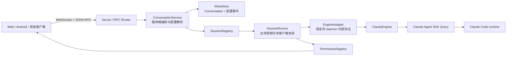
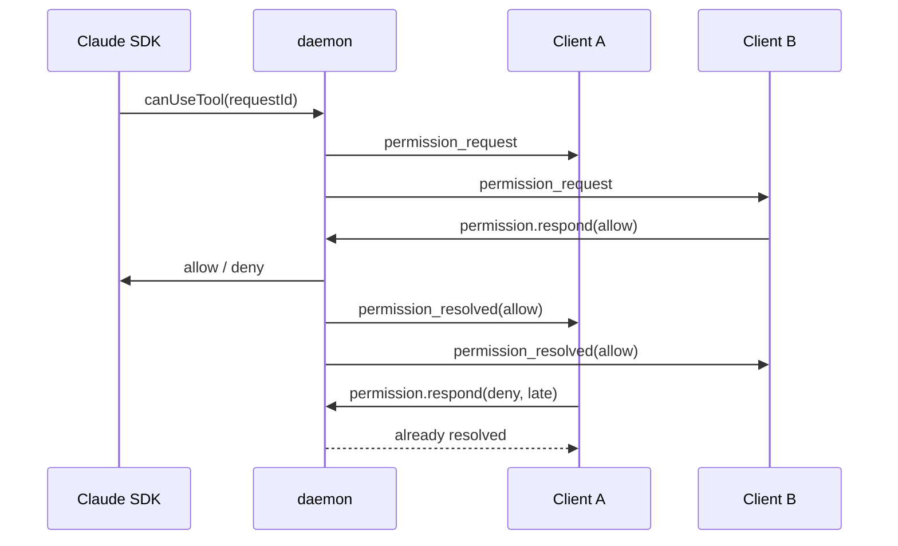

# cc-agent-daemon P0 修复与运行时架构

> 2026-07-23：对外协议已升级为仅 `conversation.*` + `conversation/event` 完整消息快照。本文涉及旧 `session.*` 或 SDK 原始事件透传的段落仅记录演进过程，当前契约以 [03-json-rpc-api-reference.md](./03-json-rpc-api-reference.md) 为准。

本文记录 Claude Agent SDK 接入的 P0 修复、当前架构边界与客户端迁移契约。详细 SDK 能力清单见 [01-claude-agent-sdk-integration-guide.md](./01-claude-agent-sdk-integration-guide.md)。

完整接口和参数契约见 [03-json-rpc-api-reference.md](./03-json-rpc-api-reference.md)。

## 1. 结论

daemon 不再把 SDK 的一条 `result` 消息或一次 `interrupt()` 当成整个会话终止。生命周期被拆成三个层次：

| 层次 | 稳定标识 | 含义 | 终止条件 |
|---|---|---|---|
| Runtime | `runtimeId` | daemon 内一条活跃 SDK `Query` 与其进程/流 | Query 迭代结束、异常或显式 stop |
| Session | `sessionId` | Claude 对话历史身份，可跨多个 Turn | Runtime 关闭；之后仍可通过 resume 创建新 Runtime |
| Turn | `turnId` | 一次用户输入及其结果 | `result`、interrupt、发送失败或 Runtime 异常 |

`requestId` 是 SDK 一次权限询问的身份。daemon 必须原样透传并以 `runtimeId + requestId` 为内部唯一键，不能自行生成替代 ID。

## 2. 分层结构



职责边界：

- `Server / RPC Router`：认证、参数校验、公开协议与错误码。
- `ConversationService`：以稳定 `conversationId` 编排打开、恢复、发送和动态配置；`open/get` 只读，不创建 SDK Runtime；第一次 `send` 才 single-flight spawn。
- `MetaStore`：保存 Conversation 与 SDK session 的映射，以及模型、effort、权限模式变更事件；SQLite 只保存 daemon 元数据，不复制 Claude JSONL 对话正文。
- `SessionRegistry`：按 `conversationId`、`runtimeId` 和 SDK `sessionId` 建立别名索引；保证同一 Conversation 只有一个活跃 Runner，并负责线程上限和最久未对话优先淘汰。
- `SessionRunner`：管理 Session/Runtime/Turn 三套状态、订阅者、唯一 active turn、事件缓冲和权限广播；每轮对话结束后刷新自动回收计时器，默认空闲 10 分钟关闭 Runtime，订阅者存在也不阻止资源回收。
- `EngineAdapter`：隔离 SDK 类型与控制面，禁止业务层维护一个不完整的手写 `Query` 接口。
- `ClaudeEngine`：唯一直接调用 `query()`、`interrupt()`、`reinitialize()`、`setPermissionMode()`、`close()` 的适配器。
- `PermissionRegistry`：维护可跨 WebSocket 重连的 pending decision。

## 3. 状态模型

### Runtime

`starting -> running -> closing -> closed`

异常路径为 `starting|running -> crashed`。只有 Runtime 到达 `closed` 或 `crashed`，Registry 才移除活跃实例并清理未决权限。

### Session

`starting -> idle <-> running <-> waiting_permission -> closing -> closed`

Runtime 异常时进入 `error`。`result` 只会让当前 Turn 结束，并使 Session 回到 `idle` 或继续下一个 queued Turn。

### Turn

`queued -> running <-> waiting_permission -> completed|interrupted|failed|limited`

其中：

- 正常 `result`：`completed`。
- SDK 限额结果：`limited`，保留 `resultSubtype`。
- 错误结果或发送失败：`failed`。
- `interrupt()` 确认不再排队的 Turn：`interrupted`。
- Runtime 提前关闭：当前和排队 Turn 统一收敛为 `interrupted` 或 `failed`。

## 4. P0 修复

### 4.1 `result` 不再终止 Session

旧行为在收到 SDK `result` 后将 Session 标成 completed 并从活跃表移除，导致同一个 SDK Query 无法继续多轮输入。

新行为：

1. 用用户消息的 SDK UUID 作为 `turnId`。
2. `result` 只完成当前 Turn。
3. 如果存在 queued Turn，立即切换为 running；否则 Session 回到 idle。
4. Query 异步迭代器结束才触发 Runtime terminal handler。

### 4.2 `interrupt` 不再终止 Session

`Query.interrupt()` 是控制当前执行，不是关闭 Query。daemon 读取 SDK 返回的 `still_queued`，据此更新 Turn 状态；Runtime 与 Session 保持活跃，可继续发送下一条消息。

RPC 返回：

```json
{
  "ok": true,
  "stillQueued": ["turn-uuid"]
}
```

### 4.3 使用 SDK 原生 Query 类型

`ClaudeEngine` 直接持有 `Query`，`EngineAdapter` 通过 `Awaited<ReturnType<Query["interrupt"]>>` 等类型绑定 SDK 控制面。SDK 升级导致的签名变化会在编译阶段暴露，而不是运行时静默失效。

SDK 依赖固定为精确版本 `0.3.217`，升级需要显式修改版本并跑完整兼容性测试。

### 4.4 权限请求使用 SDK requestId

`canUseTool` 的以下上下文会被完整映射到 daemon：

- `signal`
- `requestId`
- `toolUseID` / `agentID`
- `suggestions`
- `blockedPath` / `decisionReason`
- `title` / `displayName` / `description`
- `matchedAskRule`（内部保留）

允许响应可携带 `updatedInput` 和 `updatedPermissions`，并转换回 SDK 的 `PermissionResult`。

### 4.5 权限请求支持多设备广播与首响应结算

连接断开不自动 deny pending request。所有订阅设备都能看到和处理请求，首个响应生效：



daemon 使用 SDK `requestId` 对 pending decision 做幂等和原子结算。新订阅设备会从事件缓冲重放尚未完成的权限请求；`reinitialize()` 仍用于恢复 SDK 交互状态。pending 权限继续受 SDK `AbortSignal`、超时和 Runtime 关闭控制，避免永久泄漏。

## 5. 公开协议变化

这些变化均为向后兼容扩展；旧客户端可继续只消费 `session/event` 和 `session/status`。

### RPC

推荐客户端只使用会话级接口：

| 方法 | 语义 | 是否可能 spawn |
|---|---|---|
| `conversation.open` | 打开/创建稳定会话、加载规范化消息、附着已有 Runtime | 否 |
| `conversation.get` | 获取会话、配置与 Runtime 快照 | 否 |
| `conversation.send` | 发送消息；无 Runtime 时恢复或创建 SDK Query | 是，仅此默认入口 |
| `conversation.setModel` | 记录模型切换；Runtime 活跃时调用 `Query.setModel()` | 否 |
| `conversation.setEffort` | 记录 effort；Runtime 活跃时调用 `Query.applyFlagSettings()` | 否 |
| `conversation.setPermissionMode` | 记录权限模式；Runtime 活跃时动态应用 | 否 |
| `conversation.interrupt` | 中断当前 Turn，不关闭 Conversation/Runtime | 否 |
| `conversation.detach` | 取消当前连接订阅，等待空闲回收 | 否 |

`conversation.open/get` 返回稳定的 Message union：`user_message`、`agent_message`、`tool_result`、`model_changed`、`effort_changed`、`permission_mode_changed`、`system_message`。客户端按类型渲染，不再直接解析 Claude JSONL。

配置优先级：

- model：Conversation 最新 `model_changed` > 历史最新 assistant model > `settings.json.model` > sonnet。
- effort：Conversation 最新 `effort_changed` > `settings.json.effortLevel` > `high`。
- sonnet/opus/haiku 会匹配 `settings.json` 中 `ANTHROPIC_DEFAULT_*_MODEL` 的自定义模型 ID。

首发并发由 `conversationId -> spawn Promise` 做 single-flight；Runtime 在 SDK `start()` 完成前虽已注册，其他发送仍必须等待同一 Promise，因此不会重复 spawn，也不会在启动完成前提前发送。

Runtime 资源策略由服务端配置：

- `autoReclaimMs` 默认 `600000`：每轮最终 `result` 后重置计时，持续空闲到期后 stop；下一次消息按 `sdkSessionId` resume。
- `maxThreads` 默认 `10`：Registry 使用按 `lastConversationAt` 排序的最小堆维护空闲候选，新 spawn 前淘汰最久未对话的空闲 Runtime。
- 运行中、排队中和等待工具授权的 Runtime 不参与淘汰；全部繁忙时拒绝新 spawn，避免破坏进行中的 Turn。

以下 `session.*` 接口暂时保留用于旧客户端兼容：

- `session.sendMessage` 返回 `{ accepted: true, turnId }`。
- `session.interrupt` 返回 `{ ok: true, stillQueued }`。
- `permission.respond` 的 allow decision 支持 `updatedPermissions`。
- `session.listActive` 增加 `runtimeId`、`runtimeStatus`、`turn`。

### 通知

- `runtime/status`：Runtime 启动、运行、关闭或崩溃。
- `turn/status`：Turn 排队、运行、等待权限和终态。
- `session/status`：新增 `idle`、`waiting_permission`、`closing`、`closed`。
- `permission/request`：增加 `runtimeId`、SDK request/tool/agent 元数据。

客户端应使用 `turnId` 做一次发送的状态关联，不应再把任意 `result` 解释为 WebSocket 会话不可继续使用。

## 6. 兼容性与后续边界

实时流仍保留原始 `session/event.message`，便于逐块展示 thinking、text delta 与 tool call；历史读取和控制面已经迁移到 `conversation.*`。后续建议：

1. 增加版本化、规范化的 daemon event envelope，减少客户端直接依赖 SDK message union。
2. 将 event journal 持久化，使重连不只依赖内存 turn buffer。
3. 将文本输入扩展为 SDK content blocks，支持图片和其他多模态输入。
4. 增加 hook、MCP、structured output、file checkpoint 等能力的独立策略层。
5. 把权限 scope 的内部命名统一为 `runtimeId`，进一步消除历史 `sessionId` 命名歧义。

## 7. 验证要求

每次 SDK 或生命周期实现变更至少运行：

```bash
npm run typecheck
npm test
npm run build --prefix web
npm test --prefix web
```

关键回归场景包括：多轮 result 后继续发送、interrupt 后继续发送、Query 正常/异常退出、相同 requestId 幂等等待、权限请求多设备广播、首响应结算与断线后继续处理。
