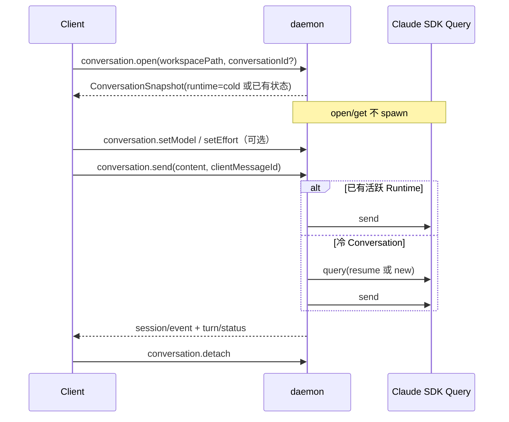

# cc-agent-daemon JSON-RPC 接口与参数定义

本文是 cc-agent-daemon 对外接口契约。客户端应优先使用 `conversation.*`；`session.*` 仅用于旧客户端兼容或底层调试。

最后同步代码日期：2026-07-23。

## 1. 契约代码来源

| 内容 | 代码定义 |
|---|---|
| JSON-RPC 请求、响应、错误码 | [`JsonRpcRequest`、`RPC_ERROR`](../../repos/cc-agent-daemon/src/rpc/protocol.ts) |
| 请求参数校验 | [`src/rpc/schemas.ts`](../../repos/cc-agent-daemon/src/rpc/schemas.ts) |
| RPC 方法及响应实现 | [`handlers`](../../repos/cc-agent-daemon/src/rpc/router.ts) |
| Conversation 返回类型 | [`ConversationSnapshot`、`ConversationEntry`](../../repos/cc-agent-daemon/src/conversation/types.ts) |
| Runtime/Session/Turn 通知类型 | [`src/events/types.ts`](../../repos/cc-agent-daemon/src/events/types.ts) |
| SDK Session 创建参数 | [`SessionCreateOptions`](../../repos/cc-agent-daemon/src/session/types.ts) |
| settings 返回类型 | [`ClaudePersonalSettings`](../../repos/cc-agent-daemon/src/settings/reader.ts) |
| daemon 运行参数 | [`DaemonConfig`](../../repos/cc-agent-daemon/src/config.ts) |
| Runtime 回收和容量策略 | [`SessionRegistry`](../../repos/cc-agent-daemon/src/session/registry.ts)、[`SessionRunner`](../../repos/cc-agent-daemon/src/session/runner.ts) |
| 历史会话摘要 | [`HistorySessionSummary`](../../repos/cc-agent-daemon/src/history/reader.ts) |

维护规则：修改公开 RPC 时，必须先修改 Zod schema 和 TypeScript 类型，再同步本文，并运行后端类型检查、后端测试、Web 构建和 Web 测试。

## 2. 传输协议

- WebSocket 地址：`/ws`。
- 协议：JSON-RPC 2.0；当前不支持 batch request。
- `id` 支持字符串或数字；不带 `id` 时视为 notification，服务端不返回响应。
- 除 `auth` 外，启用 token 时所有方法均要求连接已经认证。

请求：

```json
{
  "jsonrpc": "2.0",
  "id": 1,
  "method": "conversation.open",
  "params": {}
}
```

成功响应：

```json
{ "jsonrpc": "2.0", "id": 1, "result": {} }
```

错误响应：

```json
{
  "jsonrpc": "2.0",
  "id": 1,
  "error": { "code": -32602, "message": "invalid params" }
}
```

错误码定义见 [`RPC_ERROR`](../../repos/cc-agent-daemon/src/rpc/protocol.ts)：

| code | 名称 | 含义 |
|---:|---|---|
| `-32700` | `PARSE` | JSON 解析失败 |
| `-32600` | `INVALID_REQUEST` | 请求结构、版本或 id 非法 |
| `-32601` | `METHOD_NOT_FOUND` | 方法不存在 |
| `-32602` | `INVALID_PARAMS` | 参数校验失败或目标不存在 |
| `-32001` | `UNAUTHORIZED` | 未认证或 token 错误 |
| `-32603` | `INTERNAL` | 未映射的内部错误 |

## 3. 公共枚举

### PermissionMode

代码定义：[`PERMISSION_MODES`](../../repos/cc-agent-daemon/src/session/types.ts)

```ts
type PermissionMode =
  | "default"
  | "acceptEdits"
  | "bypassPermissions"
  | "plan"
  | "dontAsk"
  | "auto";
```

### EffortLevel

代码定义：[`EffortLevel`](../../repos/cc-agent-daemon/src/settings/reader.ts)

```ts
type EffortLevel = "low" | "medium" | "high" | "xhigh" | "max";
```

### 生命周期状态

代码定义：[`SessionStatus`、`RuntimeStatus`、`TurnStatus`](../../repos/cc-agent-daemon/src/events/types.ts)

- Conversation Runtime：`cold | spawning | idle | running | waiting_permission | closing | closed | crashed | error`
- Session：`starting | idle | running | waiting_permission | closing | closed | error`
- Runtime：`starting | running | closing | closed | crashed`
- Turn：`queued | running | waiting_permission | completed | interrupted | failed | limited`

## 4. 推荐接口：Conversation

### 4.1 `conversation.open`

打开已有 Conversation，或创建一个冷 Conversation。该方法只加载状态和历史，不会 spawn Claude Code；如果已有活跃 Runtime，则自动复用并订阅。

- 参数 schema：[`conversationOpenParams`](../../repos/cc-agent-daemon/src/rpc/schemas.ts)
- 返回类型：[`ConversationSnapshot`](../../repos/cc-agent-daemon/src/conversation/types.ts)
- 编排实现：[`ConversationService.open`](../../repos/cc-agent-daemon/src/conversation/service.ts)
- RPC 实现：[`conversation.open` handler](../../repos/cc-agent-daemon/src/rpc/router.ts)

| 参数 | 类型 | 必填 | 说明 |
|---|---|---:|---|
| `conversationId` | `string` | 否 | 稳定 Conversation ID；也可传历史 SDK session ID，服务端会建立或查找映射 |
| `workspacePath` | `string` | 是 | 工作目录，必须已加入 workspace allowlist；服务端会 canonicalize |
| `subscribe` | `boolean` | 否 | 是否订阅已有 Runtime，默认订阅 |

返回：`ConversationSnapshot`，结构见第 5 节。

### 4.2 `conversation.get`

只读获取已存在 Conversation 的完整快照，不创建 Conversation、不订阅、不 spawn。

- 参数 schema：[`conversationGetParams`](../../repos/cc-agent-daemon/src/rpc/schemas.ts)
- 返回类型：[`ConversationSnapshot`](../../repos/cc-agent-daemon/src/conversation/types.ts)
- 实现：[`ConversationService.get`](../../repos/cc-agent-daemon/src/conversation/service.ts)

| 参数 | 类型 | 必填 | 说明 |
|---|---|---:|---|
| `conversationId` | `string` | 是 | Conversation ID 或已经绑定的 SDK session ID |

### 4.3 `conversation.send`

向 Conversation 发送用户消息。仅此接口会在没有活跃 Runtime 时恢复或创建 SDK Query；同一 Conversation 的首次并发发送使用 single-flight，只 spawn 一次。

- 参数 schema：[`conversationSendParams`](../../repos/cc-agent-daemon/src/rpc/schemas.ts)
- 实现：[`ConversationService.send`](../../repos/cc-agent-daemon/src/conversation/service.ts)
- 幂等存储：[`conversation_send_receipts`](../../repos/cc-agent-daemon/src/store/db.ts)

| 参数 | 类型 | 必填 | 说明 |
|---|---|---:|---|
| `conversationId` | `string` | 是 | 目标 Conversation |
| `content` | `string` | 是 | 非空用户文本；当前尚未开放多模态 content blocks |
| `clientMessageId` | `string` | 否 | 客户端生成的幂等键；相同 ID 与相同内容返回原 `turnId`，与不同内容复用会报错 |

返回：

```ts
{
  accepted: true;
  conversationId: string;
  turnId: string;
}
```

### 4.4 `conversation.setModel`

记录模型切换；Runtime 活跃时直接调用 SDK `Query.setModel()`，不会重新 spawn。

- 参数 schema：[`conversationSetModelParams`](../../repos/cc-agent-daemon/src/rpc/schemas.ts)
- 模型解析：[`resolveModelSelection`](../../repos/cc-agent-daemon/src/conversation/config.ts)
- SDK 调用：[`ClaudeEngine.setModel`](../../repos/cc-agent-daemon/src/session/claudeEngine.ts)

| 参数 | 类型 | 必填 | 说明 |
|---|---|---:|---|
| `conversationId` | `string` | 是 | 目标 Conversation |
| `model` | `string` | 是 | `sonnet/opus/haiku`、标准 Claude 模型 ID，或 settings 中对应 family 的自定义模型 ID；无法识别时兜底 sonnet |

返回：

```ts
{
  model: {
    family: "sonnet" | "opus" | "haiku";
    requestedId: string;
    effectiveId?: string;
    source: "conversation";
  };
}
```

模型优先级：Conversation 最新切换事件 > 历史最新 assistant model > `settings.json.model` > sonnet。

### 4.5 `conversation.setEffort`

记录 effort；Runtime 活跃时通过 SDK `Query.applyFlagSettings()` 动态应用，不会重新 spawn。

- 参数 schema：[`conversationSetEffortParams`](../../repos/cc-agent-daemon/src/rpc/schemas.ts)
- 配置解析：[`resolveConversationConfig`](../../repos/cc-agent-daemon/src/conversation/config.ts)
- SDK 调用：[`ClaudeEngine.setEffort`](../../repos/cc-agent-daemon/src/session/claudeEngine.ts)

| 参数 | 类型 | 必填 | 说明 |
|---|---|---:|---|
| `conversationId` | `string` | 是 | 目标 Conversation |
| `effort` | `EffortLevel` | 是 | `low/medium/high/xhigh/max` |

返回：`{ effort: { requested, effective, source: "conversation" } }`。

effort 优先级：Conversation 最新切换事件 > `settings.json.effortLevel` > `high`。

### 4.6 `conversation.setPermissionMode`

持久化权限模式；Runtime 活跃时立即动态应用。

- 参数 schema：[`conversationSetPermissionModeParams`](../../repos/cc-agent-daemon/src/rpc/schemas.ts)
- 实现：[`ConversationService.setPermissionMode`](../../repos/cc-agent-daemon/src/conversation/service.ts)

| 参数 | 类型 | 必填 | 说明 |
|---|---|---:|---|
| `conversationId` | `string` | 是 | 目标 Conversation |
| `mode` | `PermissionMode` | 是 | 权限模式 |

返回：`{ ok: true }`。

### 4.7 `conversation.interrupt`

中断当前 Turn，不关闭 Runtime，之后可以继续发送。

- 参数 schema：[`conversationIdParams`](../../repos/cc-agent-daemon/src/rpc/schemas.ts)
- 实现：[`ConversationService.interrupt`](../../repos/cc-agent-daemon/src/conversation/service.ts)

参数：`{ conversationId: string }`。

返回：`{ ok: true, stillQueued: string[] }`。

### 4.8 `conversation.detach`

取消当前 WebSocket 连接对 Runtime 的订阅。是否订阅不影响自动回收：Runtime 会在最后一轮对话结束并持续空闲达到配置时间后关闭。

- 参数 schema：[`conversationIdParams`](../../repos/cc-agent-daemon/src/rpc/schemas.ts)
- 实现：[`ConversationService.detach`](../../repos/cc-agent-daemon/src/conversation/service.ts)

参数：`{ conversationId: string }`；返回：`{ ok: true }`。

## 5. ConversationSnapshot 与消息类型

完整代码定义：[`src/conversation/types.ts`](../../repos/cc-agent-daemon/src/conversation/types.ts)。

```ts
type ConversationSnapshot = {
  conversation: {
    id: string;
    sdkSessionId?: string;
    workspacePath: string;
  };
  runtime: {
    state: ConversationRuntimeState;
    runtimeId?: string;
  };
  config: ResolvedConversationConfig;
  currentTurn?: { turnId: string; status: string };
  messages: ConversationEntry[];
};
```

`ConversationEntry` 是可辨识联合类型，客户端必须按 `type` 分支渲染：

| `type` | 关键字段 | 用途 |
|---|---|---|
| `user_message` | `id, timestamp?, content` | 用户消息 |
| `agent_message` | `id, model?, agentId?, parentToolUseId?, content[]` | Agent 回复；content 可包含 text、thinking、tool_call |
| `tool_result` | `toolCallId, toolName?, content, isError` | 工具执行结果 |
| `model_changed` | `family, modelId` | 模型切换事件 |
| `effort_changed` | `effort` | effort 切换事件 |
| `permission_mode_changed` | `mode` | 权限模式切换事件 |
| `system_message` | `subtype?, content` | 可显示的系统消息 |

Agent content blocks：

```ts
type AgentContent =
  | { type: "text"; text: string }
  | { type: "thinking"; thinking: string }
  | {
      type: "tool_call";
      toolCallId: string;
      toolName: string;
      input: Record<string, unknown>;
    };
```

历史 JSONL 到这些类型的映射实现见 [`mapHistoryEntries`](../../repos/cc-agent-daemon/src/conversation/messages.ts)。

## 6. 实时通知

通知代码定义：[`src/events/types.ts`](../../repos/cc-agent-daemon/src/events/types.ts)；发送实现：[`SessionRunner`](../../repos/cc-agent-daemon/src/session/runner.ts)。

所有 Runtime 相关通知均携带以下身份字段：

| 字段 | 类型 | 说明 |
|---|---|---|
| `conversationId` | `string` | 稳定会话身份，客户端首选匹配字段 |
| `sessionId` | `string` | SDK session ID；SDK init 前可能暂时等于 runtimeId |
| `runtimeId` | `string` | 当前进程内 Runtime 身份 |

### `session/event`

```ts
{
  conversationId: string;
  sessionId: string;
  runtimeId: string;
  message: SDKMessage;
}
```

`message` 是 Claude Agent SDK 原始实时消息，用于增量 text/thinking/tool UI；持久化历史应使用 `conversation.get/open` 的规范化消息。

### `session/status`

参数：公共身份字段 + `{ status: SessionStatus, error?: string }`。

### `runtime/status`

参数：公共身份字段 + `{ status: RuntimeStatus, error?: string }`。

### `turn/status`

参数：公共身份字段 +：

```ts
{
  turnId: string;
  status: TurnStatus;
  error?: string;
  resultSubtype?: string;
}
```

### `permission/request`

参数定义：[`PermissionRequestNotification`](../../repos/cc-agent-daemon/src/events/types.ts)。

```ts
{
  conversationId: string;
  sessionId: string;
  runtimeId: string;
  requestId: string;
  toolName: string;
  input: unknown;
  toolUseId?: string;
  agentId?: string;
  suggestions?: unknown[];
  title?: string;
  displayName?: string;
  description?: string;
  blockedPath?: string;
  decisionReason?: string;
}
```

### `conversation/event`

当前用于推送模型、effort、权限模式等 Conversation 配置事件：

```ts
{
  conversationId: string;
  entry: ConversationEntry;
}
```

## 7. 权限接口

### `permission.respond`

- 参数 schema：[`permissionRespondParams`](../../repos/cc-agent-daemon/src/rpc/schemas.ts)
- 实现：[`permission.respond` handler](../../repos/cc-agent-daemon/src/rpc/router.ts)

| 参数 | 类型 | 必填 | 说明 |
|---|---|---:|---|
| `sessionId` | `string` | 是 | `permission/request.sessionId`；服务端会映射为 runtime scope |
| `requestId` | `string \| number` | 是 | 必须原样返回通知中的 SDK requestId |
| `behavior` | `"allow" \| "deny"` | 是 | 权限决定 |
| `updatedInput` | `Record<string, unknown>` | 否 | allow 时替换工具输入，例如 AskUserQuestion 答案 |
| `updatedPermissions` | `Record<string, unknown>[]` | 否 | allow 时持久化 SDK 权限更新 |
| `message` | `string` | 否 | deny 原因 |

返回：`{ ok: true }`。

## 8. Workspace 与历史接口

参数定义统一位于 [`src/rpc/schemas.ts`](../../repos/cc-agent-daemon/src/rpc/schemas.ts)，实现位于 [`src/rpc/router.ts`](../../repos/cc-agent-daemon/src/rpc/router.ts)。

| 方法 | 参数 | 返回 | 说明 |
|---|---|---|---|
| `workspace.list` | `{}` | `{ workspaces: WorkspaceRow[] }` | 列出 allowlist |
| `workspace.add` | `{ path: string }` | `{ workspace: WorkspaceRow }` | canonicalize 并加入 allowlist；目录必须存在 |
| `workspace.checkTrust` | `{ path: string }` | `{ trusted, path, parent }` | 检查路径是否位于 allowlist |
| `workspace.remove` | `{ id: string }` | `{ ok: boolean }` | 移除 allowlist 记录 |
| `history.listAllLocal` | `{}` | `{ projects: LocalProjectSessions[] }` | 扫描 Claude 本地 projects，不自动加入 allowlist |
| `history.listSessions` | `{ workspacePath: string }` | `{ sessions: HistorySessionSummary[] }` | 目录必须已授权 |
| `history.loadSession` | `{ sessionId: string, workspacePath: string }` | `{ messages: JsonlEntry[] }` | 兼容接口，返回 Claude JSONL；新客户端使用 `conversation.open/get` |

`WorkspaceRow` 数据定义见 [`src/store/db.ts`](../../repos/cc-agent-daemon/src/store/db.ts)。`HistorySessionSummary` 与 `LocalProjectSessions` 定义见 [`src/history/reader.ts`](../../repos/cc-agent-daemon/src/history/reader.ts)。

## 9. 设置与基础接口

| 方法 | 参数 | 返回 | 代码定义 |
|---|---|---|---|
| `ping` | `{}` | `{ ok: true }` | [`ping` handler](../../repos/cc-agent-daemon/src/rpc/router.ts) |
| `auth` | `{ token: string }` | `{ ok: true }` | [`authParams`](../../repos/cc-agent-daemon/src/rpc/schemas.ts) |
| `settings.get` | `{}` | `{ settings: ClaudePersonalSettings, runtime: RuntimePolicySettings }` | [`ClaudePersonalSettings`](../../repos/cc-agent-daemon/src/settings/reader.ts)、[`DaemonConfig`](../../repos/cc-agent-daemon/src/config.ts) |
| `mcp.listServerStatus` | `{ sessionId: string }` | `{ servers: [] }` | 当前为占位接口，尚未返回真实 MCP 状态 |

`RuntimePolicySettings`：

```ts
type RuntimePolicySettings = {
  autoReclaimMs: number;
  maxThreads: number;
};
```

参数来源和默认值定义在 [`src/config.ts`](../../repos/cc-agent-daemon/src/config.ts)：

| 设置项 | CLI | 环境变量 | 默认值 | 说明 |
|---|---|---|---:|---|
| 自动回收时间 | `--auto-reclaim-minutes <number>` | `CCLINK_AUTO_RECLAIM_MS` | `600000`（10 分钟） | 每轮对话结束后重置计时器；持续空闲到期后关闭 SDK Query |
| 最大线程数 | `--max-threads <integer>` | `CCLINK_MAX_THREADS` | `10` | 新 spawn 前通过最小堆淘汰最后对话时间最早的空闲 Runtime |

容量达到上限且所有 Runtime 都处于运行、排队或等待授权状态时，服务端拒绝新 spawn，不会强制中断进行中的对话。

## 10. 兼容接口：Session

这些接口直接暴露 Runtime/SDK Session 编排能力，新客户端不应使用它们创建或恢复 Conversation。参数 schema 见 [`src/rpc/schemas.ts`](../../repos/cc-agent-daemon/src/rpc/schemas.ts)，执行实现见 [`src/rpc/router.ts`](../../repos/cc-agent-daemon/src/rpc/router.ts)。

| 方法 | 参数 | 返回/说明 |
|---|---|---|
| `session.create` | `SessionCreateParams` | 立即 spawn，返回 `{ sessionId }` |
| `session.sendMessage` | `{ sessionId, content }` | `{ accepted: true, turnId }` |
| `session.resume` | `SessionResumeParams` | 关闭同 ID 活跃 Runtime 后 resume，返回 `{ sessionId }` |
| `session.fork` | `SessionResumeParams` | fork 历史，返回 `{ sessionId }` |
| `session.interrupt` | `{ sessionId }` | `{ ok: true, stillQueued }` |
| `session.setPermissionMode` | `{ sessionId, mode }` | `{ ok: true }` |
| `session.attachIfLive` | `{ sessionId }` | `{ attached, sessionId?, status? }` |
| `session.attach` | `{ sessionId }` | 订阅活跃 Runtime |
| `session.detach` | `{ sessionId }` | 取消当前连接订阅 |
| `session.listActive` | `{}` | `{ sessions: ActiveSessionInfo[] }` |
| `session.delete` | `{ sessionId }` | 停止 Runtime 并删除 daemon 元数据，不删除 Claude JSONL |
| `session.setMeta` | `{ sessionId, customName?, pinned?, archived? }` | 更新 daemon 本地元数据 |

`SessionCreateParams`：

| 参数 | 类型 | 必填 | 说明 |
|---|---|---:|---|
| `cwd` | `string` | 是 | 已授权工作目录 |
| `model` | `string` | 否 | SDK 模型参数 |
| `permissionMode` | `PermissionMode` | 否 | 权限模式 |
| `allowedTools` | `string[]` | 否 | SDK allowedTools |
| `disallowedTools` | `string[]` | 否 | SDK disallowedTools |
| `systemPrompt` | `string \| { preset: "claude_code", append?: string }` | 否 | 系统提示词 |
| `settingSources` | `("project" \| "user" \| "local")[]` | 否 | SDK settings 来源 |
| `effort` | `EffortLevel` | 否 | 思考强度 |
| `initialMessage` | `string` | 否 | 创建后立即发送，旧接口行为 |

`SessionResumeParams`：`{ sessionId: string, cwd: string, permissionMode?: PermissionMode, model?: string, effort?: EffortLevel }`。

`ActiveSessionInfo` 代码定义见 [`src/session/types.ts`](../../repos/cc-agent-daemon/src/session/types.ts)，包含：

```ts
{
  conversationId: string;
  sessionId: string;
  runtimeId: string;
  cwd: string;
  status: string;
  runtimeStatus: string;
  turn?: { id: string; status: string };
  subscriberCount: number;
}
```

## 11. Runtime 复用、自动回收和容量淘汰

实现代码：

- 同一 Conversation 首次发送 single-flight：[`ConversationService.ensureRuntime`](../../repos/cc-agent-daemon/src/conversation/service.ts)
- Conversation 到 Runner 的唯一索引：[`SessionRegistry.create/findRunner`](../../repos/cc-agent-daemon/src/session/registry.ts)
- 对话结束时间和回收计时器：[`SessionRunner.handleResult/scheduleReclaim`](../../repos/cc-agent-daemon/src/session/runner.ts)
- 最久未对话优先队列：[`SessionRegistry.enqueueEvictionCandidate/oldestEvictableRunner`](../../repos/cc-agent-daemon/src/session/registry.ts)

规则：

1. 同一个 `conversationId` 在一个 daemon 进程内最多对应一个活跃 Runner；SDK init 后增加 `sdkSessionId` 别名，但不会创建第二个 Runner。
2. `conversation.open/get` 不启动线程；冷会话第一次 `conversation.send` 才 spawn 或 resume。
3. 每次 Turn 收到最终 `result` 后记录 `lastConversationAt`，并从该时刻重新计算自动回收时间。
4. 自动回收只处理没有当前 Turn、没有排队 Turn、没有权限等待的空闲 Runtime；前端是否仍订阅不影响回收。
5. 新 spawn 使线程数达到上限时，从最小堆取出 `lastConversationAt` 最早且当前可回收的 Runner，先 stop 再创建新 Runner。
6. 被回收或被容量淘汰的 Conversation 不会删除历史或 `sdkSessionId`；下一次发送通过 SDK `resume` 恢复。

## 12. 客户端推荐调用链


